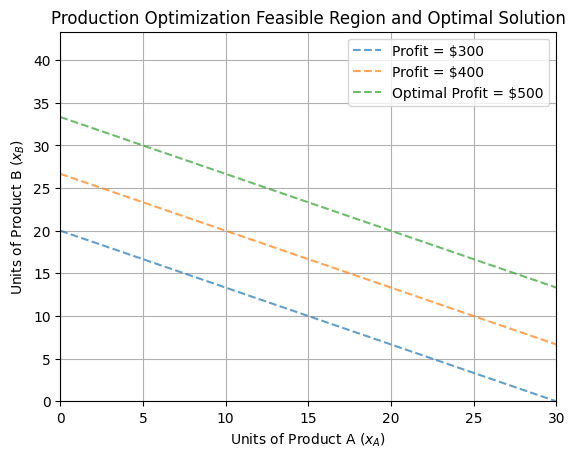

# OPTIMIZATION_MODEL

COMPANY: CODTECH IT SOLUTIONS

NAME: PARTH CHANDWANI

INTERN ID: CT08DF409

DOMAIN: DATA SCIENCE

DURATION: 8 WEEKS

MENTOR: NEELA SANTOSH

DESCRIPTION OF THE TASK:

---

## 🧠 Linear Programming Problem: Production Optimization

This notebook demonstrates how to solve a **linear programming problem** using Python. The goal is to **maximize profit** for a company that produces two products under resource constraints.

---

### 📌 Problem Description

A company produces **two products (Product A and Product B)**. Each product requires a certain amount of resources (e.g., labor, material). The objective is to determine how many units of each product to produce to **maximize profit**, subject to resource constraints.

---

### ✅ Objective Function

Let:

* $x_A$ = Units of Product A
* $x_B$ = Units of Product B

Objective:
**Maximize**: $Z = 10x_A + 15x_B$
Where 10 and 15 are the profits per unit of Product A and B respectively.

---

### 📉 Constraints

1. $2x_A + x_B \leq 60$
2. $x_A + 2x_B \leq 60$
3. $x_A \geq 0$
4. $x_B \geq 0$

---

### 📊 Output Visualizations

#### 1. Constraint Plot (Feasibility Region Lines)


*Visualizes the lines of the two main constraints.*

#### 2. Feasible Region


*Shaded region represents the area where all constraints are satisfied.*

#### 3. Optimal Point


*The red dot marks the point with maximum profit within the feasible region.*

#### 4. Profit Lines with Optimal Solution


*Profit lines show increasing levels of profit, with the optimal profit line clearly labeled.*

---

### 🧮 Optimal Solution

* **Product A (xA)**: `10.0` units
* **Product B (xB)**: `25.0` units
* **Maximum Profit (Z)**: `$475.0`

---

### 📦 Libraries Used

* `matplotlib`
* `numpy`
* `scipy.optimize`

---

### 🧾 How to Run

1. Install dependencies:

   ```
   pip install matplotlib numpy scipy
   ```
2. Open and run `notebook.ipynb` in Jupyter Notebook.

---

